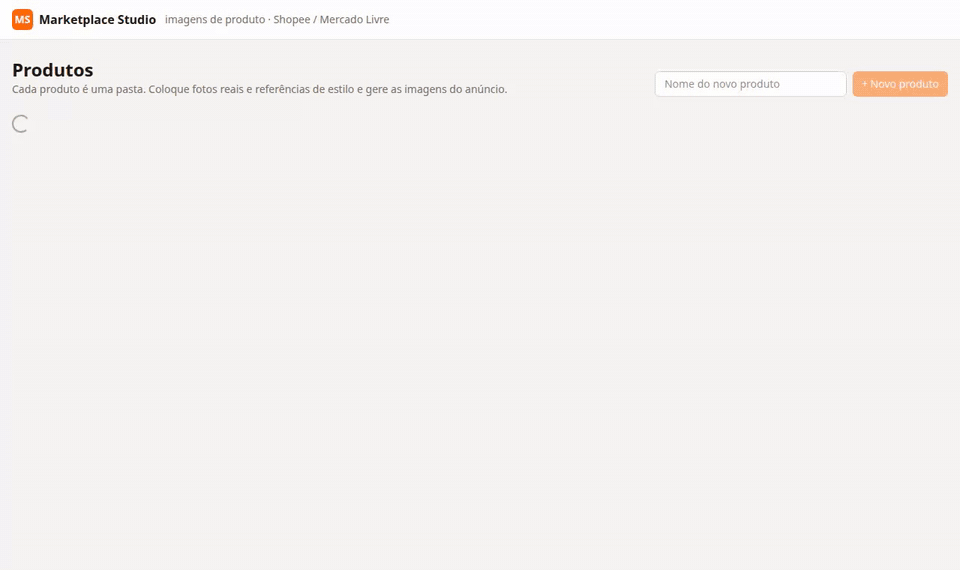

# Marketplace Studio

App local para criar as **imagens de anúncio** dos produtos impressos em 3D, para Shopee (e, depois, Mercado Livre).

Você coloca as **fotos reais** do produto e as **referências de estilo/cenário**. O app pede ao **Codex CLI** para gerar as
imagens do anúncio sem mudar o produto: forma, textos, detalhes e textura continuam os mesmos. Depois você aprova as
melhores e exporta nas proporções que o marketplace pede.



> Sem API key e sem nuvem: tudo roda no seu PC. A geração usa o `codex exec` com a sua conta do ChatGPT.

## Funcionalidades

### Produtos organizados em pastas
- Cada produto é uma pasta em `products/create/<produto>/`, com subpastas para fotos reais, estilos, candidatas, aprovadas e exportações.
- `products/` fica fora do Git (`.gitignore`): as fotos e os pedidos ficam só na sua máquina. Numa instalação nova, a pasta é criada automaticamente.
- A pasta é a fonte da verdade: imagens copiadas pelo explorador de arquivos aparecem no app, e as apagadas somem dele.
- **Marcar como pronto** move o produto para `products/ready/`, com tudo aprovado e exportado.

### Referências
- Arraste e solte as **fotos reais** do produto impresso (mais ângulos = mais fidelidade).
- Arraste e solte as **referências de estilo**: o cenário, a luz e a composição que você quer. O produto delas é trocado pelo seu.
- O campo **"O que NUNCA pode mudar"** (ex.: *o nome "Amália" e o número "1"*) entra em todos os prompts.

### Geração com IA (Codex)
| Modo | O que faz |
|---|---|
| **Fundo branco** | Packshot em fundo `#FFFFFF`, luz de estúdio e sombra suave. Remove mãos, paredes e tecidos da foto original. |
| **Cenário de referência** | Coloca o produto no cenário e no estilo das referências, como uma foto real. |
| **Variação de cor** | Recria a imagem trocando só as cores pelos **filamentos** escolhidos. Várias escolhas geram uma imagem por combinação. |
| **Reenquadrar com IA** | Estende o cenário para outra proporção (ex.: 3:4) em vez de cortar. |

- Você escolhe o formato da imagem principal (1:1 ou 3:4) e pode escrever instruções extras.
- Há uma **fila de jobs** com **log do Codex ao vivo**, tempo decorrido e botão de cancelar. Jobs interrompidos por um reinício do servidor voltam para a fila.
- Cada imagem leva de ~1 a 3 min.

### Revisão das candidatas
- Mostra a imagem gerada ao lado das imagens que o Codex recebeu, para comparar a fidelidade.
- **Aprovar** (copia para `approved/`), **Rejeitar**, **Desfazer** e **Gerar outra** (com os mesmos parâmetros).
- Filtros: para revisar, aprovadas, rejeitadas e todas. O prompt usado em cada imagem fica visível.

### Exportação para o marketplace
- Presets por marketplace em `config/marketplaces.json`. Shopee: **1:1 (1200×1200)** e **3:4 (1200×1600)**, em JPG.
- **Automático**: imagens com borda branca são completadas com branco (nada é cortado) e cenários recebem **recorte inteligente** (focado na região de interesse).
- Arquivos finais em `exports/<marketplace>/<proporção>/`.

### Cartela de filamentos
- `config/filaments.json`: cores da Voolt3D (nome, linha e hex) usadas no seletor e nos prompts de variação de cor. Pode editar à vontade.

## Estrutura de pastas

```
products/
  create/<produto>/          # em criação
    product.json             # nome, descrição e "o que nunca pode mudar"
    real/                    # fotos reais do produto impresso
    style-refs/              # cenários/estilos de inspiração
    generated/<job>.png      # candidatas geradas pelo Codex
    approved/                # cópias das candidatas aprovadas
    exports/shopee/1x1/…     # arquivos finais para o marketplace
    exports/shopee/3x4/…
  ready/<produto>/           # produtos finalizados
config/filaments.json        # cartela de filamentos
config/marketplaces.json     # proporções/tamanhos por marketplace
data/                        # SQLite (status, histórico, fila), logs dos jobs, miniaturas — pode apagar
```

## Instalação

Requisitos: Node 20+, pnpm e o Codex CLI logado (`codex login`) com `image_generation` ativo
(`codex features list | grep image_generation`).

```bash
pnpm install
pnpm dev                          # desenvolvimento em http://localhost:3456
scripts/install-service.sh        # instala como serviço systemd do usuário (sobe junto com o PC)
```

- Serviço: `systemctl --user status marketplace-studio` · logs: `journalctl --user -u marketplace-studio -f`
- O servidor só escuta em `127.0.0.1` (não fica exposto na rede).
- Se trocar a versão do Node (nvm), rode o `install-service.sh` de novo, porque o serviço guarda o caminho do Node.
- Para subir antes de fazer login: `sudo loginctl enable-linger $USER`.

## Como a geração funciona

1. O prompt é montado em `lib/prompts.ts`: bloco de fidelidade, tarefa do modo, formato e instruções extras.
2. `lib/engine/codex.ts` roda `codex exec --json -s workspace-write -C data/jobs/<id> -i <imagens…>`, com o prompt pelo stdin.
3. O Codex salva o resultado como `output.png`. Se não salvar, o app pega a imagem mais nova em `~/.codex/generated_images/<sessão>/`.
4. A imagem vai para `generated/<job>.png` e aparece em Candidatas.

A fila roda uma imagem por vez. Use `STUDIO_CONCURRENCY=2` para paralelizar. Outras variáveis opcionais:
`STUDIO_ROOT`, `CODEX_BIN`, `CODEX_HOME`.

## Stack

Next.js 15 (App Router) + TypeScript · Tailwind CSS 4 · SQLite (better-sqlite3) · sharp · Codex CLI · Vitest

## Desenvolvimento

```bash
pnpm test        # vitest: sync de pastas, aprovação, exportação e prompts
pnpm typecheck
pnpm demo        # regrava docs/demo.gif (precisa do app rodando, do Google Chrome e do ffmpeg; não altera nada)
```
